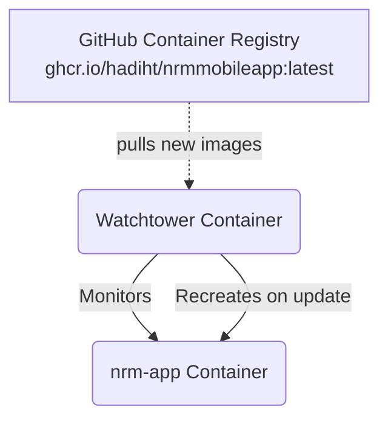

# Docker Compose Configuration Guide: NRM App & Watchtower

This document explains the structure and functionality of the `docker-compose.yml` file used for the NRM Mobile App deployment. This setup is designed for automated container updates using Watchtower.

## Architectural Overview

The Docker Compose configuration provisions two main services:
1. **`nrm-app`**: The core application container.
2. **`watchtower`**: An automated update service that monitors the `nrm-app` container for new image releases and updates it seamlessly without downtime.



---

## Detailed Component Breakdown

### 1. `nrm-app` Service

The primary service running your application.

```yaml
  nrm-app:
    image: ghcr.io/hadiht/nrmmobileapp:latest
    container_name: nrm-app
    ports:
      - "8080:80"
    restart: always
    labels:
      - "com.centurylinklabs.watchtower.enable=true"
```

- **`image`**: Pulls the Docker image from GitHub Container Registry (`ghcr.io`). It explicitly targets the `latest` tag, which is essential for Watchtower to know which version track to monitor.
- **`ports`**: Maps port `8080` on the host machine to port `80` inside the container. This makes the application accessible via `http://localhost:8080` (or your server's IP).
- **`restart: always`**: Ensures that the Docker daemon will automatically restart this container if it crashes or if the system reboots.
- **`labels`**: 
  > [!IMPORTANT]
  > The label `"com.centurylinklabs.watchtower.enable=true"` is a critical configuration flag that instructs Watchtower to monitor *only* this specific container for updates.

### 2. `watchtower` Service

Watchtower automates the process of updating running Docker containers.

```yaml
  watchtower:
    image: containrrr/watchtower
    container_name: watchtower
    environment:
      DOCKER_API_VERSION: "1.44"
    volumes:
      - /var/run/docker.sock:/var/run/docker.sock
    command: --interval 300 --label-enable
    restart: always
```

- **`environment`**: Sets `DOCKER_API_VERSION: "1.44"` to ensure compatibility between Watchtower and the specific Docker host engine version.
- **`volumes`**: 
  > [!WARNING]
  > `/var/run/docker.sock:/var/run/docker.sock` maps the host's Docker socket into the Watchtower container. This grants Watchtower the necessary permissions to control the Docker daemon (check images, stop containers, and start new ones).
- **`command`**:
  - `--interval 300`: Configures Watchtower to poll the registry for updates every 300 seconds (5 minutes).
  - `--label-enable`: Tells Watchtower to ignore all containers by default and *only* monitor containers that explicitly have the `com.centurylinklabs.watchtower.enable=true` label (like the `nrm-app` container).
- **`restart: always`**: Ensures Watchtower stays online continuously.

## How They Work Together

1. **Continuous Monitoring:** Every 5 minutes (300 seconds), Watchtower checks `ghcr.io` to see if a newer version of `ghcr.io/hadiht/nrmmobileapp:latest` exists.
2. **Automated Deployment:** If a new image is found (e.g., after an automated CI/CD pipeline pushes a new build), Watchtower automatically securely pulls the new image.
3. **Graceful Restart:** Watchtower stops the running `nrm-app` container, removes it, and spins up a new instance using the updated image with all identical configurations (ports, volumes, environment variables).

> [!TIP]
> This configuration creates a lightweight, localized Continuous Deployment (CD) pipeline without needing complex external orchestration tools.
